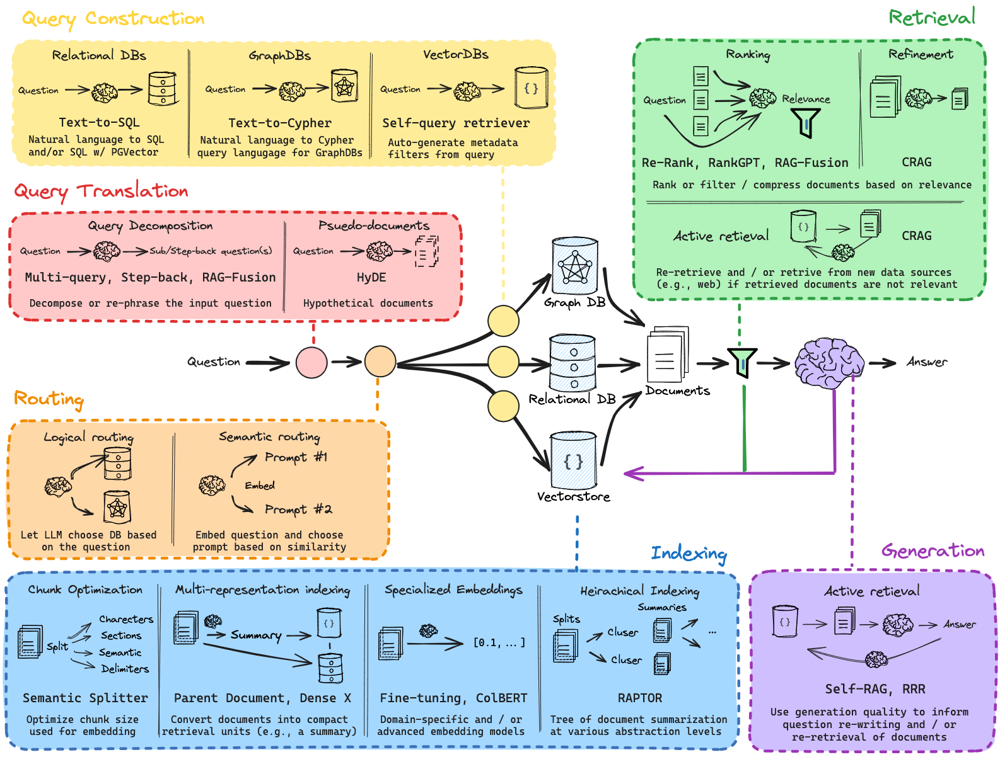

# Retrieval-Augmented Generation (RAG) Project

This repository contains a comprehensive exploration of Retrieval-Augmented Generation (RAG) for various applications.
Each notebook provides a detailed, hands-on guide to setting up and experimenting with RAG from an introductory level to advanced implementations, including multi-querying and custom RAG builds.



## Project Structure

The following notebooks can be found under the directory `tutorial_notebooks/`.

### [1]\_rag_setup_overview.ipynb

This introductory notebook provides an overview of RAG architecture and its foundational setup.
The notebook walks through: 
- **Environment Setup**: Configuring the environment, installing necessary libraries, and API setups.
- **Initial Data Loading**: Basic document loaders and data preprocessing methods.
- **Embedding Generation**: Generating embeddings using various models, including OpenAI's embeddings.
- **Vector Store**: Setting up a vector store (ChromaDB/Pinecone) for efficient similarity search.
- **Basic RAG Pipeline**: Creating a simple retrieval and generation pipeline to serve as a baseline.

### [2]\_rag_with_multi_query.ipynb

Building on the basics, this notebook introduces multi-querying techniques in the RAG pipeline, exploring: 
- **Multi-Query Setup**: Configuring multiple queries to diversify retrieval.
- **Advanced Embedding Techniques**: Utilizing multiple embedding models to refine retrieval.
- **Pipeline with Multi-Querying**: Implementing multi-query handling to improve relevance in response generation.
- **Comparison & Analysis**: Comparing results with single-query pipelines and analyzing performance improvements.

### [3]_rag_routing_and_query_construction.ipynb

This notebook delves deeper into customizing a RAG pipeline.
It covers: 
- **Logical Routing:** Implements function-based routing for classifying user queries to appropriate data sources based on programming languages.
- **Semantic Routing:** Uses embeddings and cosine similarity to direct questions to either a math or physics prompt, optimizing response accuracy.
- **Query Structuring for Metadata Filters:** Defines structured search schema for YouTube tutorial metadata, enabling advanced filtering (e.g., by view count, publication date).
- **Structured Search Prompting:** Leverages LLM prompts to generate database queries for retrieving relevant content based on user input.
- **Integration with Vector Stores:** Links structured queries to vector stores for efficient data retrieval.


### [4]_rag_indexing_and_advanced_retrieval.ipynb

Continuing from the previous customization, this notebook explores:
- **Preface on Document Chunking:** Points to external resources for document chunking techniques.
- **Multi-representation Indexing:** Sets up a multi-vector indexing structure for handling documents with different embeddings and representations.
- **In-Memory Storage for Summaries:** Uses InMemoryByteStore for storing document summaries alongside parent documents, enabling efficient retrieval.
- **MultiVectorRetriever Setup:** Integrates multiple vector representations to retrieve relevant documents based on user queries.
- **RAPTOR Implementation:** Explores RAPTOR, an advanced indexing and retrieval model, linking to in-depth resources.
- **ColBERT Integration:** Demonstrates ColBERT-based token-level vector indexing and retrieval, which captures contextual meaning at a fine-grained level.
- **Wikipedia Example with ColBERT:** Retrieves information about Hayao Miyazaki using the ColBERT retrieval model for demonstration.

### [5]_rag_retrieval_and_reranking.ipynb

This final notebook brings together the RAG system components, with a focus on scalability and optimization: 
- **Document Loading and Splitting:** Loads and chunks documents for indexing, preparing them for vector storage.
- **Multi-query Generation with RAG-Fusion:** Uses a prompt-based approach to generate multiple search queries from a single input question.
- **Reciprocal Rank Fusion (RRF):** Implements RRF for re-ranking multiple retrieval lists, merging results for improved relevance.
- **Retriever and RAG Chain Setup:** Constructs a retrieval chain for answering queries, using fused rankings and RAG chains to pull contextually relevant information.
- **Cohere Re-Ranking:** Demonstrates re-ranking with Cohere’s model for additional contextual compression and refinement.
- **CRAG and Self-RAG Retrieval:** Explores advanced retrieval approaches like CRAG and Self-RAG, with links to examples.
- **Exploration of Long-Context Impact:** Links to resources explaining the impact of long-context retrieval on RAG models.

## Getting Started

Pre-requisites: Python 3.11.7 (preferred)

1.  **Clone the repository**:

    ```{bash}
    git clone https://github.com/bRAGAI/bRAG-langchain.git 

    cd bRAG-langchain
    ```

2.  **Install dependencies**: Make sure to install the required packages listed in `requirements.txt`.

    `pip install -r requirements.txt`

3.  **Run the Notebooks**:
    Begin with `[1]_rag_setup_overview.ipynb` to get familiar with the setup process. Proceed sequentially through the other notebooks to build and experiment with more advanced RAG concepts.

4.  **Set Up Environment Variables**:

    -   Duplicate the `.env.example` file in the root directory and name it `.env` and include the following keys (replace with your actual keys):

        ```         
        #LLM Modal
        OPENAI_API_KEY="your-api-key"

        #LangSmith
        LANGCHAIN_TRACING_V2=true
        LANGCHAIN_ENDPOINT="https://api.smith.langchain.com"
        LANGCHAIN_API_KEY="your-api-key"
        LANGCHAIN_PROJECT="your-project-name"

        #Pinecone Vector Database
        PINECONE_INDEX_NAME="your-project-index"
        PINECONE_API_HOST="your-host-url"
        PINECONE_API_KEY="your-api-key"
        ```

5.  **Notebook Order**:
    To follow the project in a structured manner:

    -   Start with `[1]_rag_setup_overview.ipynb`

    -   Proceed with `[2]_rag_with_multi_query.ipynb`
    
    -   Then go through `[3]_rag_routing_and_query_construction.ipynb`

    -   Continue with `[4]_rag_indexing_and_advanced_retrieval.ipynb`

    -   Finish with `[5]_rag_retrieval_and_reranking.ipynb`

## Usage

After setting up the environment and running the notebooks in sequence, you can:

1.  **Experiment with Retrieval-Augmented Generation**:
    Use the foundational setup in `[1]_rag_setup_overview.ipynb` to understand the basics of RAG.

2.  **Implement Multi-Querying**:
    Learn how to improve response relevance by introducing multi-querying techniques in `[2]_rag_with_multi_query.ipynb`.

## Incoming Notebooks (work in progress)
1. **Context Precision with RAGAS + LangSmith**
   - Guide on using RAGAS and LangSmith to evaluate context precision, relevance, and response accuracy in RAG.


<br>

    Contributor: Taha Ababou (GitHub: @tahababou12)